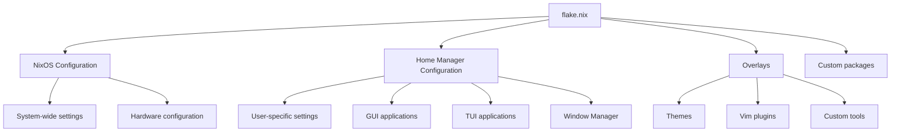

# NixOS Configuration

Welcome to my NixOS configuration repository! This project uses NixOS with
Flakes and Home Manager to create a reproducible and customizable system
configuration.

Here's a [demo](https://www.youtube.com/watch?v=X7IMYLIEqaM)

## Table of Contents

- [Overview](#overview)
- [Project Structure](#project-structure)
- [Features](#features)
- [Installation](#installation)
- [Usage](#usage)
- [Customization](#customization)
- [Architecture](#architecture)
- [Contributing](#contributing)
- [License](#license)

## Overview

This repository contains my personal NixOS configuration, leveraging the power
of Nix Flakes and Home Manager to create a fully reproducible and customizable
system. It includes configurations for various tools, window managers, and
applications, tailored for my specific needs.

## Project Structure

```
.
├── flake.nix
├── flake.lock
├── hosts
│   └── default
│       ├── configuration.nix
│       ├── hardware-configuration.nix
│       ├── home.nix
│       └── main-user.nix
├── modules
│   ├── home-manager
│   │   ├── gui
│   │   ├── tui
│   │   └── wm
│   └── nixos
├── overlays
│   ├── default.nix
│   ├── themes.nix
│   ├── tools.nix
│   └── vim-plugins.nix
├── packages
│   ├── colorful-winsep.nix
│   ├── materia-theme-transparent.nix
│   ├── msi-perkeyrgb.nix
│   ├── neon-town-sddm.nix
│   ├── tree-sitter-cli.nix
│   └── winbar.nix
├── README.md
└── secrets
    └── secrets.yaml
```

## Features

- **NixOS**: Declarative and reproducible system configuration
- **Nix Flakes**: Hermetic and reproducible package management
- **Home Manager**: User environment management
- **Hyprland**: Tiling Wayland compositor
- **Neovim**: Customized text editor configuration
- **GUI and TUI applications**: Carefully selected and configured
- **Custom overlays**: For themes, Vim plugins, and tools
- **Secrets management**: Using `sops-nix`

## Installation

1. Install NixOS on your system
2. Clone this repository:
   ```
   git clone https://github.com/yourusername/nixos-config.git
   ```
3. Copy the `hardware-configuration.nix` from your current NixOS installation to
   `hosts/default/`
4. Customize the configuration files as needed
5. Apply the configuration:
   ```
   sudo nixos-rebuild switch --flake .#default
   ```

## Usage

To update and switch to the latest configuration:

```
sudo nixos-rebuild switch --flake .#default
```

To update home-manager configuration (although i dont use this):

```
home-manager switch --flake .#tai@nixos
```

## Customization

This configuration is highly customizable. Here are some key files you might
want to modify:

- `flake.nix`: Add or remove inputs, modify outputs
- `hosts/default/configuration.nix`: System-wide configuration
- `hosts/default/home.nix`: User-specific configuration
- `modules/`: Add or modify module configurations
- `overlays/`: Customize package overlays

## Architecture

Here's a high-level overview of the configuration architecture:



## Contributing

Contributions are welcome! Please feel free to submit a Pull Request.

## License

This project is licensed under the MIT License - see the [LICENSE](LICENSE) file
for details.

> [!WARNING]
>
> I don't know what i'm doing would love feedback/tips/help. Also AI made this
> readme
