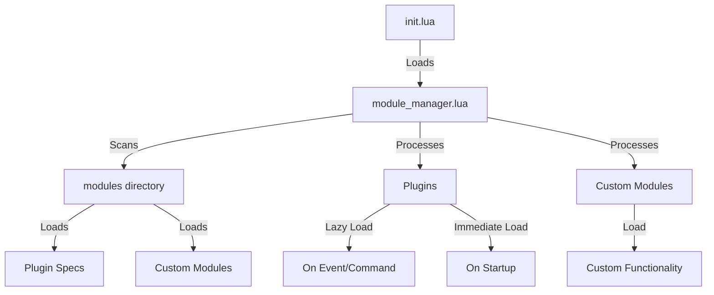

# Module Manager for Neovim

## Table of Contents

- [Introduction](#introduction)
- [Features](#features)
- [Installation](#installation)
- [Usage](#usage)
- [Specification Format](#specification-format)
- [Lazy Loading](#lazy-loading)
- [Custom Modules](#custom-modules)
- [Examples](#examples)
- [Architecture](#architecture)
- [Contributing](#contributing)
- [License](#license)

## Introduction

The Module Manager is a lightweight, flexible system designed specifically for
managing Neovim plugins and custom modules within a NixOS environment using
home-manager. This project was born out of the need for a simpler, more
integrated solution for Neovim configuration management in NixOS.

### Why Module Manager?

1. **NixOS Integration**: While popular plugin managers like Lazy.nvim offer
   powerful features, they can be complex to integrate seamlessly with NixOS and
   home-manager. Our Module Manager is designed from the ground up to work
   harmoniously with the NixOS ecosystem.

2. **Simplicity**: We found existing solutions to be overly complex for our
   needs. Module Manager provides a streamlined approach to plugin management
   without sacrificing functionality.

3. **Nix-Centric Approach**: Instead of relying on a plugin manager to handle
   installations, we leverage Nix packages to install plugins. Module Manager
   focuses solely on configuring and loading these pre-installed plugins.

4. **Reduced Bloat**: By offloading plugin installation to Nix and focusing on
   configuration and loading, Module Manager remains lean and efficient.

5. **Custom Module Support**: Beyond plugin management, Module Manager allows
   easy integration of custom Lua modules, providing a unified approach to
   Neovim configuration.

### How It Works

1. **Plugin Installation**: Plugins are installed via Nix packages, typically
   defined in your `home.nix` or a dedicated Neovim configuration file.

2. **Configuration**: Module Manager provides a simple specification format for
   configuring these installed plugins.

3. **Loading**: Plugins are loaded either immediately or lazily based on your
   specifications.

4. **Custom Modules**: Your own Lua modules can be seamlessly integrated
   alongside plugins.

This approach combines the power of Nix for package management with a simple,
purpose-built system for Neovim configuration, resulting in a clean,
reproducible, and efficient setup.

## Features

- **Plugin Management**: Easily configure and load Neovim plugins installed via
  Nix
- **Lazy Loading**: Improve startup time by loading plugins only when needed
- **Custom Modules**: Integrate your own Lua modules seamlessly
- **Keymaps Management**: Centralized keymap configuration for plugins
- **Error Handling**: Robust error reporting for plugin loading and
  configuration
- **NixOS Integration**: Designed to work flawlessly with NixOS and home-manager

## Installation

1. Ensure your NixOS configuration includes the necessary Neovim plugins. In
   your `home.nix` or Neovim configuration file, add something like:

```nix
programs.neovim = {
  enable = true;
  plugins = with pkgs.vimPlugins; [
    # Your plugins here
    telescope-nvim
    nvim-treesitter
    # ... other plugins
  ];
};
```

2. Clone this repository into your Neovim configuration directory:

3. In your `init.lua`, add the following line:

```lua
require("core.module_manager").setup()
```

## Usage

To use the Module Manager, create specification files for your plugins in the
`lua/modules` directory. Here's a basic example:

```lua
-- lua/modules/ui/somecolorscheme.lua
local module_manager = require("core.module_manager")

module_manager.use({
    name = "somecolorscheme",
    config = function()
        vim.cmd("colorscheme somecolorscheme")
    end
})
```

## Specification Format

Each plugin or module is defined using a specification table with the following
fields:

- `name` (string, required): The name of the plugin
- `event` (string or table): Event(s) to trigger lazy loading
- `ft` (string or table): Filetype(s) to trigger lazy loading
- `cmd` (string or table): Command(s) to trigger lazy loading
- `keys` (table): Keymaps to trigger lazy loading
- `config` (function): Configuration function for the plugin
- `keymaps` (table): Keymaps to be set for the plugin

## Lazy Loading

Lazy loading can be configured using the `event`, `ft`, `cmd`, or `keys` fields.
Here's an example:

```lua
module_manager.use({
    name = "telescope.nvim",
    cmd = "Telescope",
    config = function()
        require("telescope").setup({})
    end,
    keymaps = {
        n = {
            ["<leader>ff"] = "<cmd>Telescope find_files<CR>",
        }
    }
})
```

## Custom Modules

Custom modules can be added using the `use_custom` function:

```lua
module_manager.use_custom({
    name = "my_custom_module",
    config = function()
        -- Your custom module setup
    end
})
```

## Examples

### Plugin with Lazy Loading

```lua
module_manager.use({
    name = "nvim-treesitter",
    event = "BufRead",
    config = function()
        require("nvim-treesitter.configs").setup({
            ensure_installed = "all",
            highlight = { enable = true },
        })
    end
})
```

### Custom Status Line

```lua
module_manager.use_custom({
    name = "custom_statusline",
    config = function()
        vim.o.statusline = "%f %y %m %r %=%l,%c %P"
    end
})
```

## Architecture

The Module Manager follows this high-level architecture:



## Contributing

Contributions are welcome! Please feel free to submit a Pull Request.

> [!WARNING]
>
> I don't know what i'm doing would love feedback/tips/help
